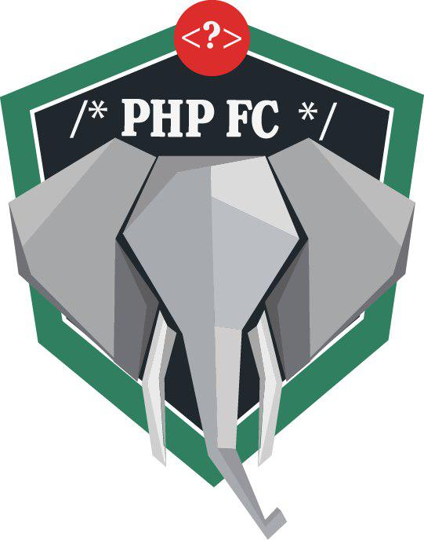

# PHPFC

O PHPFC é o evento mais recorrente da comunidade PHPDF, que realizamos mensalmente. 

Atualmente, estamos com uma proposta de duas lightning talks ou duas palestras por mês, vamos lá!

Atualmente PHPFC significa PHP For Community, mas surgiu inicialmente como PHP Futebol e Cerveja.

Se você gosta de Cerveja, Tecnologia ou PHP, está convidado a participar do nosso meetup.  

Nossa intenção é trazer interação entre diversas pessoas da área de qualquer nível técnico e o melhor de GRAÇA.

Para acompanhar nossos eventos você pode clicar [aqui](https://www.meetup.com/pt-BR/php-df/) !

### Histórico de eventos

Confira nosso histórico de eventos:
* [PHPFC XV](./2017/XV/Readme.md)
* [PHPFC XIV](./2017/XIV/Readme.md)
* [PHPFC XVI](./2017/XVI/Readme.md)
* [PHPFC XVII](./2017/XVII/README.md)
